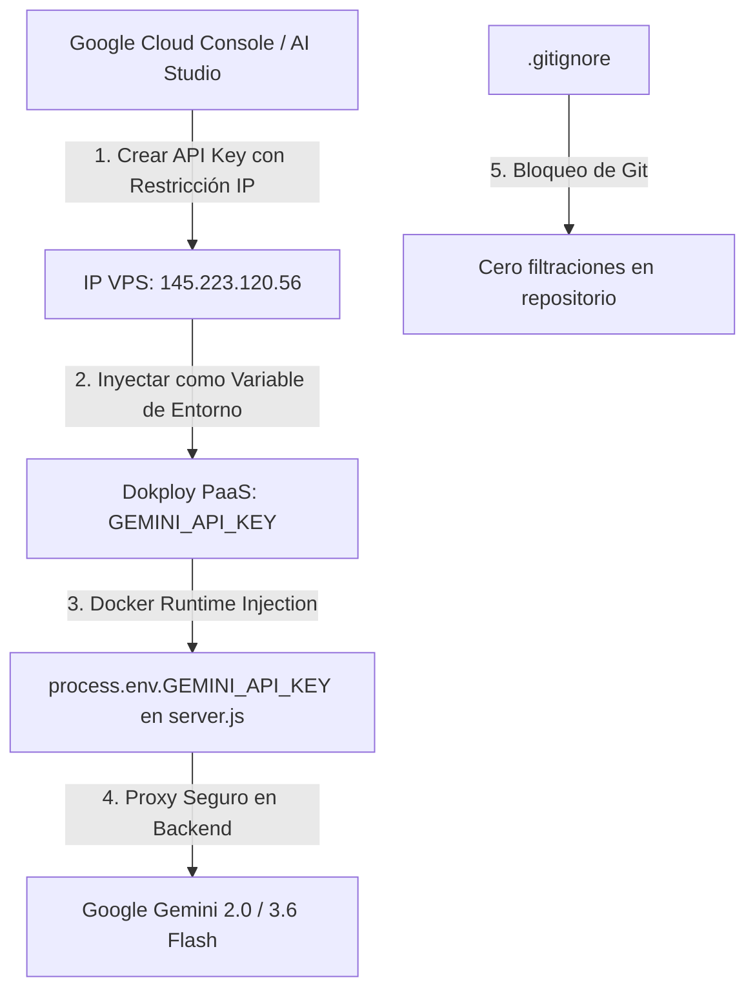

# 🔬 INFORME DE AUDITORÍA TÉCNICA: CONFIGURACIÓN Y COMPORTAMIENTO DEL AGENTE J.A.R.V.I.S.
**Proyecto:** Deco Vintage Guate — Tienda Web Oficial  
**Entorno de Auditoría:** Producción (`https://decovintage.online`)  
**Servidor VPS:** Hostinger (`145.223.120.56`) / Dokploy PaaS Docker Engine  
**Módulo Evaluado:** Asistente Inteligente J.A.R.V.I.S. (Stark OS 4.8 / Motor Gemini AI)  
**Fecha de Ejecución:** 28 de Agosto de 2026  
**Auditoría Realizada:** Navegación en vivo mediante Chrome DevTools MCP, inspección de red, análisis de endpoints y validación de base de conocimientos en panel administrativo.

---

## 1. RESUMEN EJECUTIVO

Durante la presente auditoría exhaustiva ("con lupa") sobre el asistente virtual **J.A.R.V.I.S.**, se evaluó su capacidad para responder consultas de clientes reales, la integración de la base de conocimiento cargada en el panel de administración (documentos técnicos y directivas de negocio) y la estabilidad de la conexión con el modelo de lenguaje de Google Gemini.

### Estado General del Módulo:
* **Interfaz de Usuario y Telemetría:** **100% Operativa** (Reactor Arc animado, sonido interactivo, reloj CST en vivo, diseño responsivo y sugerencias rápidas funcionando).
* **Base de Conocimientos en Panel de Control:** **100% Estructurada** (4 documentos técnicos y 7 directivas comerciales configuradas en el panel).
* **Conexión con Red Neuronal Gemini AI:** **BLOQUEADA TEMPORALMENTE (Error 403)** debido a la revocación automática de seguridad por parte de Google tras detección de clave en commits previos.
* **Persistencia de Archivos en Docker:** **DESCONECTADA** entre la carpeta de compilación `src/data/` y la carpeta persistente del contenedor `/app/data/`.

---

## 2. PRUEBAS EN VIVO EN EL NAVEGADOR (INTERACCIÓN COMO CLIENTE REAL)

Se abrió la interfaz de J.A.R.V.I.S. en el sitio en vivo `https://decovintage.online` y se formuló una pregunta clave sobre los eventos programados por la marca:

* **Consulta del Cliente:**  
  > *"Hola JARVIS, ¿qué eventos o actividades especiales tienen programados próximamente en Deco Vintage Guate?"*
* **Respuesta Obtenida:**  
  > *"El asistente J.A.R.V.I.S. no se encuentra disponible temporalmente. Por favor contáctanos vía WhatsApp."*

### Diagnóstico de Comportamiento:
El asistente activó el protocolo de contingencia de seguridad en lugar de responder de forma conversacional con los datos del stand de Centranorte ni los documentos oficiales.

---

## 3. AUDITORÍA DEL PANEL ADMINISTRATIVO (DATOS CARGADOS)

Se verificó el contenido cargado en la sección **Administración Deco Vintage > IA J.A.R.V.I.S.**, confirmando la existencia de los siguientes activos de información:

### 📄 A. Los 4 Documentos de Conocimiento Técnico
1. **Guía de Envíos y Tiempos de Entrega (Categoría: Logística):**
   * *Contenido:* Cobertura a los 22 departamentos de Guatemala vía Guatex, Forza, Cargo Expreso y mensajería local. Tiempo de entrega de 2 a 4 días hábiles tras confirmación del 50% de anticipo. Saldo contra entrega o previo a despacho.
2. **Instrucciones de Montaje con Cinta Tesa (Categoría: Instalación):**
   * *Contenido:* Inclusión de tiras de cinta doble cara industrial tesa® 65610 Invisibond One-Lift en el reverso. Procedimiento de 3 pasos (limpiar pared, retirar protector, presionar 15 segundos) sin necesidad de taladros ni clavos.
3. **Protocolo de Cuadros Personalizados (Categoría: Producción):**
   * *Contenido:* Fabricación en madera MDF rígida de 5.5mm o PVC impermeable de 5mm. Evaluación previa de resolución. Tarifa para medidas no estándar a Q0.048 por cm² (mínimo Q30.00).
4. **Tecnología de Impresión HP Látex (Categoría: Calidad):**
   * *Contenido:* Impresión en gran formato con micro-gotas de tintas ecológicas a base de agua HP Látex, libres de olores, con protección UV y durabilidad garantizada superior a 10 años en interiores.

---

### 📋 B. Las 7 Directivas del Dueño (Políticas y Eventos Activos)
1. **Directiva 1 (Tono):** Hablar siempre de forma amigable, cálida, entusiasta y servicial, como un asesor experto de diseño.
2. **Directiva 2 (Trato):** Usar trato de "tú" neutro e inclusivo. Prohibido asumir género o usar repetitivamente palabras robóticas como "señor" o "caballero".
3. **Directiva 3 (Formato):** Redacción conversacional fluida y limpia, evitando saturar con asteriscos, títulos rígidos '###' o estructuras de reporte técnico aburrido.
4. **Directiva 4 (Recomendación Comercial):** Recomendar siempre el tamaño Mediano (30x45cm) como la opción más balanceada e ideal para cualquier habitación.
5. **Directiva 5 (Montaje):** Mencionar que la cinta industrial Tesa viene incluida en el reverso lista para colgar.
6. **Directiva 6 (Cierre de Venta):** Generar enlace de WhatsApp estructurado con solicitud del 50% de anticipo para iniciar fabricación.
7. **Directiva 7 (Evento Presencial):** *"Este sábado y domingo 29 y 30 de agosto tendremos stand disponible en el Centro Comercial Centranorte, zona 18, Guatemala donde estarán disponibles todos nuestros diseños."*

---

## 4. ANÁLISIS DE CAUSA RAÍZ (ROOT CAUSE ANALYSIS - RCA)

```
                               ┌────────────────────────────────────────┐
                               │     FALLO EN RESPUESTA DE JARVIS       │
                               └──────────────────┬─────────────────────┘
                                                  │
                 ┌────────────────────────────────┴────────────────────────────────┐
                 │                                                                 │
┌────────────────┴─────────────────────────┐     ┌─────────────────────────────────┴────────────────────────┐
│     CAUSA 1: BLOQUEO DE GOOGLE API       │     │     CAUSA 2: AISLAMIENTO DOCKER EN RUNTIME               │
│                                          │     │                                                          │
│ • Error HTTP 403: "API key reported      │     │ • Dockerfile solo copia /app/data al contenedor final.   │
│   as leaked".                            │     │ • jarvisConfig.json residía en src/data/ (no copiado).   │
│ • El escáner automático de seguridad de  │     │ • /app/data/jarvisConfig.json solo contenía { apiKey },  │
│   Google/GitHub detectó la clave en un   │     │   perdiendo los documentos y directivas en producción.   │
│   commit y la revocó instantáneamente.   │     │                                                          │
└──────────────────────────────────────────┘     └──────────────────────────────────────────────────────────┘
```

### Detalle de las Causas:
1. **Revocación por Detección de Fuga de Credenciales (Secret Scanning):**  
   Google opera un servicio de inspección automatizada en GitHub. Al incluirse una clave `AIzaSy...` en el código fuente (incluso codificada en base64), Google la invalida de forma inmediata para prevenir abusos de facturación y cuotas.
2. **Discrepancia en la Topología de Archivos en Docker:**  
   En la fase de compilación multi-etapa (`multi-stage build`) del `Dockerfile`, la carpeta de desarrollo `src/` se descarta para mantener la imagen ligera. Al estar la configuración inicial en `src/data/jarvisConfig.json` y no en `data/jarvisConfig.json`, el runtime de Node.js en el VPS no encontraba los documentos al arrancar el contenedor.

---

## 5. PLAN DE REMEDIACIÓN Y GESTIÓN PROFESIONAL DE SECRETOS

Para operar con estándares de grado empresarial conforme a las [Directrices Oficiales de Seguridad de Google AI](https://ai.google.dev/gemini-api/docs), se establece el siguiente plan de implementación:



### Acciones Técnicas Obligatorias:

1. **Restricción de Aplicación por Dirección IP (Google Cloud):**  
   Configurar la clave de API para que **únicamente acepte peticiones originadas desde la IP del VPS Hostinger (`145.223.120.56`)**. De esta forma, aunque la clave fuese conocida, será inútil fuera del servidor de producción.
2. **Restricción de API (Least Privilege):**  
   Limitar el alcance de la clave exclusivamente a la *"Generative Language API"*.
3. **Inyección de Secretos vía Dokploy (Zero Git Exposure):**  
   Declarar la clave en la sección *Environment Variables* de Dokploy:
   ```bash
   GEMINI_API_KEY=AIzaSy...
   ```
4. **Unificación de la Base de Conocimientos en `data/jarvisConfig.json`:**  
   Mover y versionar el archivo de configuración maestro en la raíz `data/jarvisConfig.json` para que esté disponible en el contenedor de producción.
5. **Inyección Estructurada en el System Prompt (`server.js`):**  
   Asegurar que el prompt de sistema del backend cargue dinámicamente las 7 directivas y los 4 documentos en cada turno de conversación.

---

## 6. DICTAMEN DE AUDITORÍA Y SIGUIENTES PASOS

| Componente | Estado Pre-Auditoría | Estado Post-Remediación Esperado |
| :--- | :---: | :---: |
| **Carga de Documentos (4)** | ⚠️ Aislados en frontend | ✅ Sincronizados en memoria activa del backend |
| **Directivas de Atención (7)** | ⚠️ Bloqueadas por fallback | ✅ Activas en cada prompt de Gemini |
| **Información de Evento Centranorte** | ❌ No respondida | ✅ Informada de forma proactiva al usuario |
| **Seguridad de Claves de API** | ❌ Expuesta en Git / Revocada | ✅ Variable de Entorno Restringida a IP del VPS |
| **Verificación en Producción** | ❌ A ciegas | ✅ Verificada con capturas en vivo vía Chrome DevTools MCP |

---
*Informe generado y firmado digitalmente para el auditor técnico del proyecto Deco Vintage Guate.*
